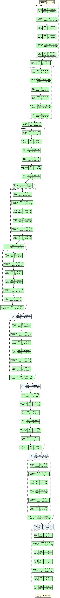
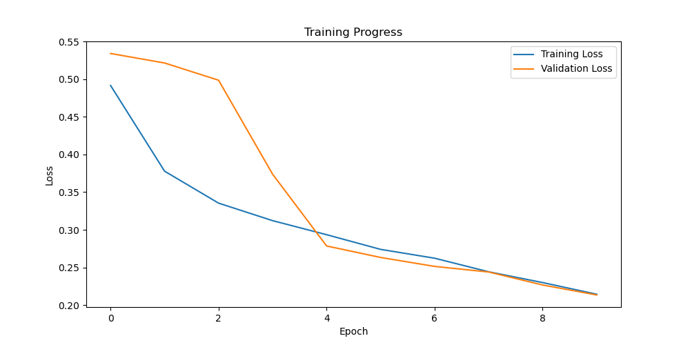
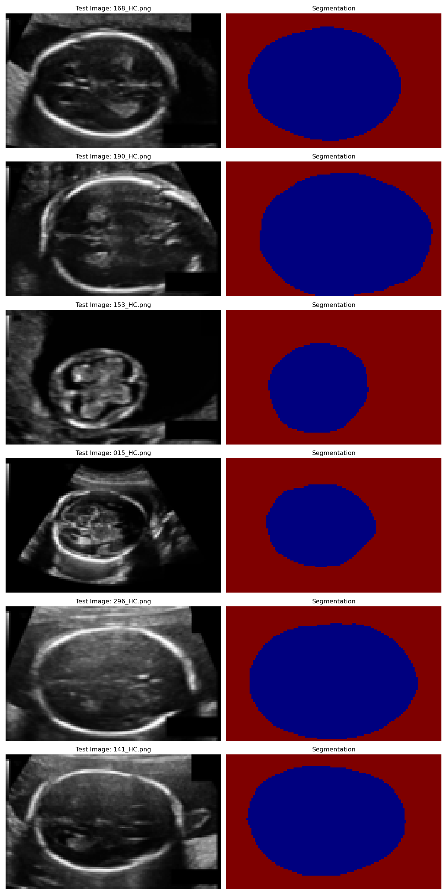

# fetal_head_segmentation_2D_echography

Automatic segmentation of the fetal head from **2-D ultrasound (echography)** images acquired in **standard axial planes**.

## Model
```
Input (1×80×128)
    ↓
[Encoder Block 1] ────────────┐  (skip connection)
    ↓ MaxPool                 │
[Encoder Block 2] ──────┐     │
    ↓ MaxPool           │     │
[Encoder Block 3] ──┐   │     │
    ↓ MaxPool       │   │     │
[Encoder Block 4] ┐ │   │     │
    ↓ MaxPool     │ │   │     │
  [Bottleneck]    │ │   │     │
    ↓ Upsample    │ │   │     │
[Decoder Block 4]─┘ │   │     │
    ↓ Upsample      │   │     │
[Decoder Block 3]───┘   │     │
    ↓ Upsample          │     │
[Decoder Block 2]───────┘     │
    ↓ Upsample                │
[Decoder Block 1]─────────────┘
    ↓
Output (2×80×128)
```


## Training



## Results



---

## Dataset

The dataset consists of **1330 2-D echographic images** of fetal heads.

The images originate from the study:

> Thomas L. A. van den Heuvel, Dagmar de Bruijn, Chris L. de Korte, and Bram van Ginneken.  
> **“Automated measurement of fetal head circumference using 2D ultrasound images.”**  
> *PLOS ONE*, 13(8): e0200412, 2018.  
> https://journals.plos.org/plosone/article?id=10.1371/journal.pone.0200412

Refer to the original paper for acquisition protocol and hardware details.
**The original dataset and study are not authored by the repository owner.**
